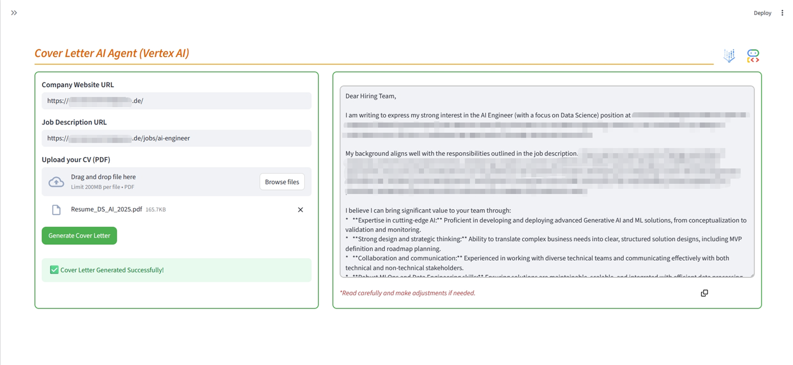

# Cover Letter Agent (Vertex AI Deployment)

An intelligent agentic workflow designed to generate tailored, professional cover letters. This project utilizes a remote agent deployed in **Google's Vertex AI Agent Engine** to research company information, parse your CV, and analyze job descriptions to craft the perfect cover letter.

## 🚀 Features

- **Vertex AI Agent Engine**: The agent is deployed as a remote agent in Google Cloud, ensuring robust and scalable performance.
- **Automated Company Research**: Scours the web for company culture, values, mission, and vision using **Google Search** .
- **CV Parsing**: Extracts key details (Summary, Skills, Experience, Education) from your PDF CV.
- **Job Description Analysis**: Understands the requirements and nuances of the job posting utilizing **Tavily** [API](https://docs.tavily.com/documentation/api-reference/introduction).
- **Context-Aware Generation**: Synthesizes all gathered data to write a non-pretentious, value-focused cover letter.
- **Multi-Model Support**: Choose different Gemini models for sub-agents and the main generator.
- **Language Level Customization**: Select specific English proficiency levels (B1, B2, C1, C2).
- **Gemini 3.0 Thinking Level**: Control the reasoning depth (minimal, low, medium, high) for the latest Gemini models.

## 📂 Project Structure

The project is organized to support Vertex AI deployment:

```
.
├── cl_agent_uv.sh       # Script to run the application (Local/Remote)
├── requirements.txt     # Python dependencies
├── app/
│   ├── cover_letter_agent/  # Main agent logic
│   ├── sub_agents/          # Individual specialized agents
│   ├── config.json          # Key parameters for the agent
│   ├── deploy_vertex.py     # Script to deploy and manage the remote agent
│   ├── main_vertex.py       # CLI entry point for vertex agent
│   ├── streamlit_vrtx.py    # Streamlit app for remote agent
│   ├── ui.py                # UI components
│   ├── utils.py             # Utility functions
│   ├── vertex_utils.py      # Utilities for Vertex AI interactions
│   └── .env_remote          # Configuration for remote deployment
```

## 🛠️ Architecture

The system is built using a **Sequential Agent** that orchestrates a **Parallel Research Team**:

1.  **Parallel Research Team** (Runs simultaneously):
    *   `web_researcher_agent`: Uses Google Search to find company insights.
    *   `job_information_agent`: Uses Tavily API to obtain information about a job role.

2.  **Cover Letter Generator** (`cl_generator_agent`):
    *   Takes the aggregated outputs from the research team and the parsed CV.
    *   Generates the final cover letter using a Gemini model.

## 📦 Requirements

- Python 3.10+
- `uv` (for script execution)
- `google-cloud-aiplatform==1.128.0`
- `streamlit==1.51.0`
- `python-dotenv`
- `nest_asyncio`
- `pypdf`
- Access to Tavily API (Get your free API key [here](https://docs.tavily.com/documentation/api-credits)).

## 📋 Prerequisites
In order to deploy the ADK agent to production using Vertex AI Agent Engine, you need to have the following prerequisites:
1.  A Google Cloud Project with the essential APIs enabled:
    * Vertex AI API - For AI models and Agent Engine.
    * Cloud Storage API - For staging bucket
    * Cloud Build API - For building agent containers
    * Cloud Run Admin API - For deployment infrastructure
    * Artifact Registry API - For container storage

2.  A Google Cloud Storage bucket for staging the agent.
3.  Authentication setup with Google Cloud CLI installed and configured.


## 🔧 Configuration
1.  Clone the repository (`deploy_gcp` branch).
2.  Ensure `uv` is installed on your system.
3.  Install dependencies:
    ```bash
    pip install -r requirements.txt
    ```
    *Or if using uv for environment management:*
    ```bash
    uv pip install -r requirements.txt
    ```
4.  Create a `.env_remote` file in the `app/` directory and add your prerequisites:
    ```env
    GOOGLE_GENAI_USE_VERTEXAI=True
    GOOGLE_CLOUD_PROJECT=<project_id>
    GOOGLE_CLOUD_LOCATION=<location>
    AGENT_NAME=<agent_name>
    GOOGLE_CLOUD_STAGING_BUCKET=gs://<bucket_name>
    USER_ID=<user_id>
    TAVILY_API_KEY=<tavily_api_key>
    ```

## ☁️ Vertex AI Deployment

The project includes `deploy_vertex.py` to handle the full lifecycle of the agent in Vertex AI Agent Engine.

### 1. Setup Environment

Ensure you have a `.env_remote` file in the `app/` directory with the necessary Google Cloud credentials and Agent Engine settings.

### 2. Manage Deployments

Use `deploy_vertex.py` to create, update, or delete your agent deployment.

**Deploy / Update Agent:**
After changing code or `agent.py` configuration, run this to update the remote agent.
```bash
uv run app/deploy_vertex.py -m create
```

**List Deployments:**
```bash
uv run app/deploy_vertex.py -m list
```

**Delete Deployment:**
```bash
uv run app/deploy_vertex.py -m delete -i <RESOURCE_ID>
```

### 3. Manage Sessions

You can create and manage remote sessions for testing or interaction.

**Create Session:**
```bash
uv run app/deploy_vertex.py -m create_session
```

**List Sessions:**
```bash
uv run app/deploy_vertex.py -m list_sessions
```

**Delete Specific Session:**
```bash
uv run app/deploy_vertex.py -m delete_session -i <SESSION_ID>
```

**Delete All Sessions:**
```bash
uv run app/deploy_vertex.py -m delete_all_sessions
```

## 🚀 Development
To change key parameters of the remote agent (Model, Thinking Level, Language Proficiency, Tavily settings), you must modify the `app/config.json` file directly:
```json
{
  "MODELS": "gemini-2.5-flash",
  "G3_THINK": "low",
  "LANG_LEVEL": "Upper-Intermediate (B2)",
  "TAVILY_ADVANCE": false
}
```

> ℹ️ 
> `MODELS` can be a string (same model for all) or a JSON object:
> ```json
> "MODELS": {
>     "sub_agents_model": "gemini-2.5-flash",
>     "main_agent_model": "gemini-3-flash-preview"
> }
> ```

> After changing any of these values, you **must update the deployment** (`uv run app/deploy_vertex.py -m create`) for the changes to take effect (see **Vertex AI Deployment** section for more details).

## 🏃 Usage

You can run the agent in two different ways:

### 1. Streamlit Web Application

The most user-friendly way to interact with the agent. Provides a graphical interface for uploading your CV and entering URLs.



```bash
./cl_agent_uv.sh --remote
```

> ℹ️ Since this project utilizes a remote agent deployed in Vertex AI, **all agent settings in the UI sidebar are disabled**. See **Development** section for instructions on how to change key parameters of the remote agent in `config.json`.

### 2. CLI (Command Line Interface)

Run the agent directly from the terminal using `app/main_vertex.py`. This method is useful for quick tests or automation.

```bash
uv run app/main_vertex.py -f path/to/your_cv.pdf
```

#### Arguments

| Argument | Long Flag | Default | Description |
| :--- | :--- | :--- | :--- |
| `-f` | `--file_name` | **Required** | Path to the PDF CV file. |

*Note: You will be prompted to enter the Company URL and Job Description URL after the script starts if they are not set in environment variables.*

## 📊 Logging
The agent provides real-time logging in the console, detailing the current agent parameters and session ID.   
It also provides a link to the remote agent session in Vertex AI Agent Engine to track the session events.  
    


## 🐳 Docker

You can also run the Streamlit application using Docker.

### Building the Image

To build the Docker image using the `Dockerfile` and `.dockerignore` files, run the following command from the project root:

```bash
docker build -t cl-remote-agent .
```

### Running the Container

To run the container, use the following command (replace the placeholders with Google Cloud prerequisites and your actual API keys):

```bash
docker run --name cl_remote_agent \
--rm -it -p 8501:8501 \
-e GOOGLE_GENAI_USE_VERTEXAI=True \
-e GOOGLE_CLOUD_PROJECT=<GOOGLE_CLOUD_PROJECT_ID> \
-e GOOGLE_CLOUD_LOCATION=<GOOGLE_CLOUD_LOCATION (e.g. us-central1)> \
-e GOOGLE_CLOUD_STAGING_BUCKET=<gs://google_cloud_bucket> \
-e AGENT_NAME=cover_letter_agent \
-e USER_ID=<user_id> \
-e TAVILY_API_KEY=<OUR_TAVILY_API_KEY> \
-v "$HOME/.config:/root/.config" \
cl-remote-agent
```