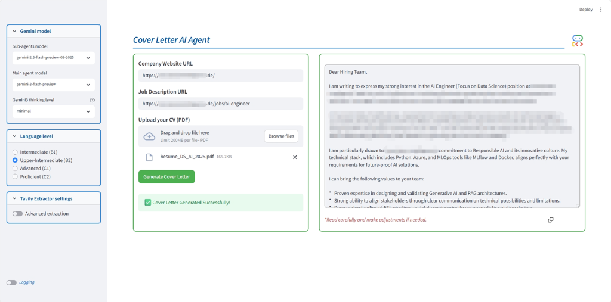

# Cover Letter Agent (Google ADK)

An intelligent agentic workflow designed to generate tailored, professional cover letters. This project utilizes **Google's ADK (Agent Development Kit)** and **Gemini models** to research company information, parse your CV, and analyze job descriptions to craft the perfect cover letter.

## 🚀 Features

- **Automated Company Research**: Scours the web for company culture, values, mission, and vision using **Google Search** .
- **CV Parsing**: Extracts key details (Summary, Skills, Experience, Education) from your PDF CV.
- **Job Description Analysis**: Understands the requirements and nuances of the job posting utilizing **Tavily** [API](https://docs.tavily.com/documentation/api-reference/introduction).
- **Context-Aware Generation**: Synthesizes all gathered data to write a non-pretentious, value-focused cover letter.
- **Multi-Model Support**: Choose different Gemini models for sub-agents and the main generator.
- **Language Level Customization**: Select specific English proficiency levels (B1, B2, C1, C2).
- **Gemini 3.0 Thinking Level**: Control the reasoning depth (minimal, low, medium, high) for the latest Gemini models.

## 📂 Project Structure

The project code is organized within the `app/` directory:

```
app/
├── cover_letter_agent/  # Main agent logic and orchestration
├── sub_agents/          # Individual specialized agents (researcher, job info extractor, etc.)
├── main.py              # CLI entry point for local execution
├── streamlit_app.py     # Streamlit web application
├── utils.py             # Utility functions
└── .env                 # Configuration file
```

## 🛠️ Architecture

The system is built using a **Sequential Agent** that orchestrates a **Parallel Research Team**:

1.  **Parallel Research Team** (Runs simultaneously):
    *   `web_researcher_agent`: Uses Google Search to find company insights.
    *   `job_information_agent`: Uses Tavily API to obtain information about a job role.

2.  **Cover Letter Generator** (`cl_generator_agent`):
    *   Takes the aggregated outputs from the research team.
    *   Generates the final cover letter using a Gemini model.

## 📊 Logging

To help monitor the process, the outputs of all sub-agents are logged in the `logs/` folder.

- **File Name**: `sub_agents_output_<company_domain>.log`
- **Utility**: These logs are useful for reviewing the information discovered and extracted about the company and the specific job role.

## 📦 Requirements

- `Python >=3.10`
- `google-adk`
- `google-cloud-aiplatform`
- `streamlit==1.51.0`
- `python-dotenv`
- `tavily-python`
- `nest_asyncio`
- `pydantic`
- `pypdf`
- Access to Google Gemini API and Search tools.
- Access to Tavily API (Get your free API key [here](https://docs.tavily.com/documentation/api-credits)).

## 🔧 Configuration

1.  Clone the repository.
2.  Install dependencies:
    ```bash
    pip install -r app/requirements.txt
    ```
3.  Create a `.env` file in the `app/` directory (or root) and add your API keys:
    ```env
    GOOGLE_GENAI_USE_VERTEXAI=False
    GOOGLE_API_KEY=<your_google_api_key>
    TAVILY_API_KEY=<your_tavily_api_key>
    ```

## 🏃 Usage

You can run the agent in three different ways depending on your preference.

### 1. Streamlit Web Application

The most user-friendly way to interact with the agent. Provides a graphical interface for uploading your CV and entering URLs.



```bash
streamlit run app/streamlit_app.py
```

**Features:**
- Sidebar for selecting **Sub-agents model** and **Main agent model** (e.g., `gemini-2.5-flash-preview`).
- **Language Level** selection (Intermediate B1 to Proficient C2).
- **Gemini3 Thinking Level** configuration (minimal, low, medium, high).
- Toggle for **Tavily Advanced Extraction**.
- Real-time status updates.
- **Logging Toggle**: Controls the console logging level. When enabled, verbose log information about the agent's workflow is printed out in the console (DEBUG mode).
- Copy-to-clipboard functionality for the generated letter.

### 2. CLI (Command Line Interface)

Run the agent directly from the terminal using `app/main.py`. This method is useful for quick tests or automation.

```bash
python app/main.py -f path/to/your_cv.pdf [options]
```

#### Arguments

| Argument | Long Flag | Default | Description |
| :--- | :--- | :--- | :--- |
| `-f` | `--file_name` | **Required** | Path to the PDF CV file. |
| `-v` | `--verbose` | `False` | Enable verbose logging to see detailed agent thoughts/actions. |
| `-t` | `--tavily` | `False` | Enable Tavily advanced extraction for web research. |
| `-l` | `--language_level` | `b2` | Language proficiency level (b1, b2, c1, c2). |
| `-T` | `--thinking_level` | `minimal` | Gemini 3.0 thinking level (minimal, low, medium, high). |
| `-m` | `--sa_model` | `gemini-2.5-flash-preview-09-2025` | Model name used by sub-agents (researcher, job info extractor, etc.). |
| `-M` | `--ma_model` | `gemini-3-flash-preview` | Model name used by the main agent for final generation. |

#### Example

```bash
python app/main.py -f ./my_cv.pdf --verbose --tavily --ma_model gemini-3-pro-preview
```

*Note: You will be prompted to enter the Company URL and Job Description URL after the script starts if they are not set in environment variables.*

### 3. Google ADK Web UI

Launch the agent using the Google Agent Development Kit's standard web interface.

```bash
adk web [options]
```  
Run `adk web --help` to see available options.

## 🐳 Docker

You can also run the Streamlit application using Docker.

### Building the Image

To build the Docker image using the `Dockerfile` and `.dockerignore` files, run the following command from the project root:

```bash
docker build -t cl-agent-streamlit .
```

### Running the Container

To run the container, use the following command (replace the placeholders with your actual API keys):

```bash
docker run --name cl-agent \
  --rm -it \
  -p 8501:8501 \
  -e GOOGLE_API_KEY=<your_google_api_key> \
  -e TAVILY_API_KEY=<your_tavily_api_key> \
  -v "$(pwd)/logs:/cl_agent/logs" \
  cl-agent-streamlit
```