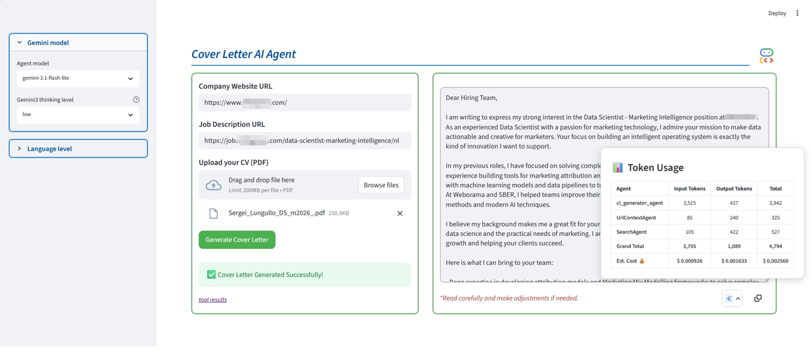

# Cover Letter Agent (Google ADK)

An intelligent agentic workflow designed to generate tailored, professional cover letters. This project utilizes **Google's ADK (Agent Development Kit)** and **Gemini models** to research company information, parse your CV, and analyze job descriptions to craft the perfect cover letter.

## 🚀 Features

- **Automated Company Research**: Scours the web for company culture, values, mission, and vision using **Google Search** .
- **CV Parsing**: Extracts key details (Summary, Skills, Experience, Education) from your PDF CV.
- **Job Description Analysis**: Understands the requirements and nuances of the job posting.
- **Context-Aware Generation**: Synthesizes all gathered data to write a non-pretentious, value-focused cover letter.
- **Language Level Customization**: Select specific English proficiency levels (B1, B2, C1, C2).
- **Gemini 3.0 Thinking Level**: Control the reasoning depth (minimal, low, medium, high) for the latest Gemini models.

## 📂 Project Structure

The project code is organized within the `app/` directory:

```
app/
├── cover_letter_agent/    # Main agent orchestration
├── main.py                # CLI entry point
├── streamlit_app.py       # Main Streamlit web application
├── pages/                 # Additional Streamlit pages
│   └── logs_viewer.py     # Logs monitoring interface
├── tokentracker.py        # Token tracking utility
├── ui.py                  # Streamlit UI components
├── style.css              # Custom styling for Streamlit
├── utils.py               # Shared utility functions
└── .env                   # Configuration file
```

## 🛠️ Architecture

1. The app reads the uploaded CV and builds a prompt containing the company URL, job URL, and CV text.
2. The root `LlmAgent` (`cl_generator_agent`) uses two tools:
   - `SearchAgent` with `google_search` to learn about the company.
   - `UrlContextAgent` with `url_context` to extract the job description.
3. The agent returns a JSON string with the final result:
   - `status: "success"` with the generated letter in `message`
   - `status: "error"` with a clear failure message.


## 📊 Logging

To help monitor the process, the intermediate results of agent's tools are logged in the `logs/` folder. These can be viewed directly within the Streamlit application or via the raw log files.

- **Logs Viewer**: Access the **"tool results"** link in the Streamlit UI to view agent activities and reasoning in real-time.
- **File Name**: `sub_agents_output_<company_domain>.log`
- **Utility**: These logs are useful for reviewing the information discovered and extracted about the company and the specific job role.

## 📦 Requirements

- `Python >=3.12`
- `uv` (Fast Python package installer and resolver)
- `google-adk`
- `google-cloud-aiplatform`
- `streamlit`
- `python-dotenv`
- `nest_asyncio`
- `pypdf`
- `rich`
- Access to Google Gemini API and Search tools.

## 🔧 Configuration

1.  Clone the repository.
2.  Install dependencies:
    Using `uv` (recommended):
    ```bash
    uv sync
    ```
    Using `pip`:
    ```bash
    pip install -r app/requirements.txt
    ```
3.  Create a `.env` file in the `app/` directory (or root) and add your API keys:
    ```env
    GOOGLE_GENAI_USE_VERTEXAI=False
    GOOGLE_API_KEY=<your_google_api_key>
    ```

## 🏃 Usage

You can run the agent in three different ways depending on your preference.

### 1. Streamlit Web Application

The most user-friendly way to interact with the agent. Provides a graphical interface for uploading your CV and entering URLs.



```bash
uv run streamlit run app/streamlit_app.py
```

Alternatively, you can use the provided helper script:
```bash
./cl_agent_uv.sh
```

**Features:**
- Sidebar for selecting:
    - **Agent model** (e.g., `gemini-3.1-flash-lite`).
    - **Language Level** (Intermediate B1 to Proficient C2).
    - **Gemini3 Thinking Level** (minimal, low, medium, high).
- **Logging Toggle**: Controls the console logging level. When enabled, verbose log information about the agent's workflow is printed out in the console (DEBUG mode).
- **Built-in Logs Viewer**: Dedicated page to monitor agent's tool results and research data.
- **Token Usage Statistics**: A popover displaying token usage and estimated cost statistics is available after the generation process completes.
- Copy-to-clipboard functionality for the generated letter.
- Real-time status updates.

### 2. CLI (Command Line Interface)

Run the agent directly from the terminal using `app/main.py`. This method is useful for quick tests or automation.

```bash
uv run python app/main.py -f path/to/your_cv.pdf [options]
```

#### Arguments

| Argument | Long Flag | Default | Description |
| :--- | :--- | :--- | :--- |
| `-f` | `--file_name` | **Required** | Path to the PDF CV file. |
| `-v` | `--verbose` | `False` | Enable verbose logging to see detailed agent thoughts/actions. |
| `-l` | `--language_level` | `b1` | Language proficiency level (b1, b2, c1, c2). |
| `-T` | `--thinking_level` | `minimal` | Gemini 3.0 thinking level (minimal, low, medium, high). |
| `-m` | `--model` | `gemini-3.1-flash-lite-preview` | Gemini model used by the root agent. |

#### Example

```bash
uv run python app/main.py -f ./my_cv.pdf --verbose --model gemini-3-pro-preview
```

*Note: You will be prompted to enter the Company URL and Job Description URL after the script starts if they are not set in environment variables.*

Upon successful completion, the script will display detailed token usage and estimated cost statistics formatted as a table in the terminal.

### 3. Google ADK Web UI

Launch the agent using the Google Agent Development Kit's standard web interface.

```bash
uv run adk web [options]
```  
Run `uv run adk web --help` to see available options.

## 🐳 Docker

You can also run the Streamlit application using Docker.

### Building the Image

To build the Docker image using the `Dockerfile` and `.dockerignore` files, run the following command from the project root:

```bash
docker build -t cl-agent-streamlit .
```

### Running the Container

To run the container, use the following command (replace the placeholders with your actual API keys):

```bash
docker run --name cl-agent \
  --rm -it \
  -p 8501:8501 \
  -e GOOGLE_API_KEY=<your_google_api_key> \
  -v "$(pwd)/logs:/cl_agent/logs" \
  cl-agent-streamlit
```